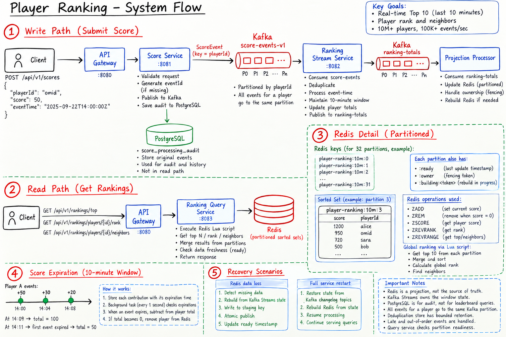

# Player Ranking

Real-time, event-time Top 10 and player ranking for a gaming platform. The active window is exact,
not bucketed, and ranking reads stay fast while score events keep arriving.

## Table of Contents

1. [Solution Summary](#solution-summary)
2. [Problem Statement](#1-problem-statement)
3. [Architecture](#2-architecture)
4. [Data Model](#3-data-model)
5. [Why This Design](#4-why-this-design)
6. [API Endpoints](#5-api-endpoints)
7. [Running Locally](#6-running-locally)
8. [Possible Future Improvements](#7-possible-future-improvements)

## Solution Summary

Score requests first enter the system through the write API. The write service validates the
request and writes a ranking event to Kafka. `202 Accepted` means Kafka acknowledged the write. It
does not mean Kafka Streams, Redis, or the read model has processed the event yet.

Kafka Streams processes the Kafka events. It owns the main ranking state in RocksDB state stores,
with Kafka changelog topics behind those stores. It applies the exact 10-minute sliding window,
deduplicates retries, expires old contributions, and writes absolute player totals for the
projector.

Redis is the fast read model. Kafka Streams keeps the authority; Redis is a projection. If Redis is
lost, the system can rebuild it from Kafka Streams state after that state has been restored from
its changelogs if needed.

Each Kafka partition is projected to one Redis Sorted Set named
`player-ranking:10m:<partition>`. The sorted set stores players as members and their active scores
as scores. Incremental projection updates use `ZADD` for active players and `ZREM` for players
whose active score has expired to zero.

Ranking reads do not calculate the leaderboard from all players again. They run one Lua script
against Redis. The script checks readiness keys first, then uses Redis commands such as
`ZREVRANGE ... WITHSCORES`, `ZCARD`, `ZSCORE`, `ZADD NX`, `ZREVRANK`, and `ZREM` to answer Top 10,
rank, and neighbor queries quickly and consistently across the partition sorted sets.

Redis also has readiness and ownership keys. `player-ranking:10m:<partition>:owner` is a leased
owner token. `player-ranking:10m:<partition>:ready` is a freshness heartbeat with a 5-second TTL.
Readers return `503` when any partition is missing, not ready, or too stale. Lua scripts are used
where Redis operations must be atomic, such as fenced updates, publishing a rebuilt partition, and
cross-partition reads.



---

## 1. Problem Statement

Suppose a gaming platform awards points to players continuously, and the leaderboard must always
reflect only the **last 10 minutes** of activity:

```text
player_id = "player-42"
score = 0
window = last 10 minutes
```

Now imagine **10 million active players**, each capable of generating score events, at a
sustained rate of **100,000 events/second**.

Design a **real-time ranking system** that can serve a Top 10 and per-player rank under this load
while considering the following requirements:

* The active window must be exact — 10 minutes, not an approximate bucket.
* Late and out-of-order events must be admitted safely, within a bounded grace period.
* Duplicate events (client retries) must not double-count a player's score.
* Expired contributions must age out of the ranking automatically, even during input inactivity.
* Ranking reads must stay fast and available even if the read-side cache is lost entirely.
* If strong consistency conflicts with availability or throughput, the trade-off should be explicit.

This repository provides the implementation and correctness tests for that design; it does not
claim a measured 100K/second production capacity — see [7](#7-possible-future-improvements).

---

## 2. Architecture

The main idea: **Kafka is the durable input log. Kafka Streams state and changelogs are the source
of truth for the current window. Redis is a disposable read projection.** PostgreSQL is not used
for ranking reads or Redis recovery. It only stores processing audit summaries.

### 2.1 Modules

| Module | Responsibility | Local port |
| --- | --- | --- |
| `api-gateway` | YAML routing and bounded request-ID propagation | 8080 |
| `score-service` | Validation, event identity and acknowledged Kafka publication | 8081 |
| `ranking-stream-service` | Calculator, projection, recovery and asynchronous audit sink | 8083 |
| `ranking-query-service` | Atomic Redis queries and projection readiness | 8082 |
| `shared` | Small wire contract, JSON codec and servlet request-ID filter | - |
| `integration-tests` | Real Kafka, Redis, PostgreSQL and HTTP integration tests | Random |

Domain records and window policy have no Spring dependencies. Application services sit behind the
HTTP controllers. The producer and ranking reader have explicit ports. Streams, Redis, SQL, and
transport serialization stay in infrastructure code.

### 2.2 Write path

1. A `POST /api/v1/scores` request reaches the **api-gateway**, which routes it (via
   `spring.cloud.gateway.server.webmvc.routes`) to **score-service** and propagates `X-Request-ID`.
2. **score-service** validates the payload, resolves event identity from `(playerId, eventId)`,
   and publishes to Kafka with an idempotent producer, `acks=all`, LZ4 compression and small
   batching. `202 Accepted` means Kafka acknowledged the write — nothing else has happened yet.
3. **ranking-stream-service**'s calculator (a custom Kafka Streams Processor API topology, not the
   DSL) admits the event if it is within the sliding window and grace period, deduplicates it
   against the `seen` store, adds its contribution to the `totals` store, and schedules its
   expiry in the `expiry` store.
4. A wall-clock punctuator runs roughly once per second, expiring due contributions from `totals`
   even during complete input inactivity, and emits absolute per-player totals.
5. A second stage, the **projector**, coalesces those totals per player and flushes bounded
   batches of absolute `ZADD`/`ZREM` operations to Redis at most once per second or every 10,000
   dirty players.
6. **ranking-query-service** answers Top 10, rank and neighbor queries directly from Redis via
   atomic Lua scripts, never touching Kafka or PostgreSQL on the read path.

### 2.3 Exact sliding window

At evaluation time `T`, an accepted event contributes only when:

```text
T - 10 minutes < eventTime <= T
```

There are no buckets and no minute-boundary approximation. Each contribution is indexed by
`eventTime + 10 minutes` in the `expiry` store. The wall-clock punctuator moves the evaluation
boundary forward. It does not replace event timestamps. Observed time is persisted and cannot move
backwards per task, so clocks must be synchronized across hosts.

For example, contributions +50 at 14:00, +30 at 14:04 and +20 at 14:08 total 100 at 14:09. At
14:11, the 14:00 contribution has expired and the total is 50. At exactly 14:10, the 14:00
contribution is already outside the window.

Admission allows up to **two minutes of lateness**, inclusive, relative to the calculator's
observation time. This is a custom grace policy, not a Kafka Streams DSL tumbling-window grace
setting. Out-of-order events inside this bound are added and expire at their original event-time
deadlines. Older events are rejected even if they are still inside the ten-minute interval. Future
events are also rejected. A long Kafka backlog can therefore cause rejections; availability does
not mean unlimited lateness.

Expiration is logically exact to milliseconds, but externally visible changes have scheduling,
Kafka commit and projection latency, typically a few seconds. Queries are not linearizable with
the client's current wall clock.

### 2.4 Handling duplicate events

Deduplication lasts **15 minutes from first acceptance**: the ten-minute window, two-minute grace,
and a three-minute retry margin. Retries do not refresh retention. After dedup retention, an
unchanged retry is already too late and cannot enter the ranking again. Identity is scoped to
`(playerId, eventId)`; reusing an ID with different content for the same player is a contract
violation (first accepted content wins), while the same UUID used by another player is a
different identity.

### 2.5 What happens if Redis is lost

This is the most important failure case for the **read path**, so it gets its own treatment.

Redis is not the source of truth. Redis can be deleted and rebuilt. Kafka Streams state stores and
their Kafka changelog topics contain the state needed for recovery.

Redis updates are outside Kafka transactions. The system promises **eventual convergence of an
idempotent projection**. It does not promise an atomic Kafka/Redis commit, and it does not promise
read-your-writes after `202`.

1. A task obtains a random owner token with a 15-second lease; every update, lease renewal and
   snapshot publication checks that token.
2. On assignment or detected Redis data loss, the task removes readiness and scans its current
   Streams projection store into a private staging sorted set named
   `player-ranking:10m:<partition>:building:<uuid>`.
3. Each staging batch renews ownership and refreshes the staging TTL to 60 seconds.
4. A single fenced Lua operation deletes the old live sorted set, renames the complete staging set
   into place, persists it, and publishes readiness. This final publish step is atomic.
5. Normal incremental updates resume. Readers return `503` with `Retry-After: 1` until all
   partitions have valid, fresh readiness.

Readers never see a partially rebuilt partition. The live set is replaced only after the staging
set is complete. Lua is used where Redis operations must be atomic and fenced by the owner token.

If Redis loses all data while Streams keeps running, the missing owner lease triggers a rebuild
from current Streams state. If local Streams state is also lost, Kafka Streams first restores it
from committed changelogs. Then the same Redis rebuild runs, including the calculator's original
expiry deadlines and dedup state. The application does not simply replay all original score events
into Redis on every Redis loss.

Redis must use `noeviction`. Complete loss is automatically detected. Manual deletion of one live
sorted-set key is not automatically detected; to force reconstruction, stop the affected projector
instances, delete the affected owner/readiness keys, and restart them.

### 2.6 Architecture Patterns & Design Decisions

| Pattern | Where it appears | Why it's used here |
|---|---|---|
| **CQRS** | Write side (`POST` → Kafka → Streams → projector) and read side (`GET` → Redis) are fully separate code paths and stores. | Lets ingestion absorb throughput and reads stay low-latency, without either compromising the other. |
| **Event-Driven Architecture / Event Streaming** | `score-events-v1` → calculator → `ranking-totals-v1` → projector. | Decouples ingestion, windowing and projection so each can fail, restart or scale independently. |
| **Exactly-Once Stream Processing** | Calculator and projector use `exactly_once_v2`, 250 ms commits, distinct application IDs. | Only committed calculator output reaches the projector; source offsets, changelogs and outputs commit together. |
| **Idempotent Consumer / Idempotent Receiver** | `seen`/`seen-expiry` dedup stores; absolute (not incremental) Redis and PostgreSQL writes. | Makes redelivery — client retry, stream replay or projector redelivery — a safe no-op. |
| **Sharded / Partitioned State** | 32 Kafka partitions; each owns its own RocksDB stores and Redis sorted set (`player-ranking:10m:<partition>`). | Bounds recovery scope and lets many partitions be rebuilt independently. |
| **Materialized View** | The `player-ranking:10m:<partition>` Redis sorted sets. | Rebuilt from the Streams `projection` store; Redis is disposable, Streams state is authoritative. |
| **Lease-Based Ownership** | 15-second owner token per partition, checked on every update and renewal. | Prevents a stalled former owner from publishing after another task acquires the lease. |
| **Fenced Swap / Staged Rebuild** | Rebuild into a private staging set, then one atomic Lua swap. | No partition is ever exposed half-rebuilt to readers. |
| **Bounded Sweep** | Expiry sweep processes at most 10,000 expirations per task per tick; projector flushes at most 10,000 dirty players per batch. | Keeps a single hot task or partition from monopolizing a tick or blocking Redis flushes. |
| **Freshness / Readiness Gating** | A task emits no freshness heartbeat until due expiration work drains. Query reads also check every partition's readiness key and owner key. | Returns `503` instead of returning stale or partially rebuilt ranking data. This is not normal backpressure. |
| **Durable Stateful Stream Processing** | RocksDB stores backed by Kafka changelogs, restored after task/Pod failure. | Lets counters and dedup state survive process loss without relying on heap state. |
| **Audit Sink (async, best-effort accounting)** | Completed-minute accepted/duplicate/rejected summaries, written to PostgreSQL via a separate batch listener. | Gives operational visibility without putting PostgreSQL on the hot write or read path. |
| **Ports & Adapters-inspired layering** | Domain records and window policy have no Spring dependency; HTTP, Streams, Redis and SQL stay in infrastructure. | Keeps policy code testable while Kafka Streams processors remain Kafka-specific adapters. |

---

## 3. Data Model

### 3.1 Contracts and stores overview

| Name | What it represents |
|---|---|
| `ScoreEvent` | One accepted score, published to `score-events-v1`, keyed by `playerId`. |
| `ranking-totals-v1` | Absolute per-player totals and reserved clock markers, keyed by `playerId`. |
| `ranking-audit-v1` | Completed-minute accepted/duplicate/rejected counts, keyed by `partition:processing-minute`. |
| `player-ranking:10m:<partition>` (Redis sorted set) | Active score per player, for one partition's window. |
| PostgreSQL audit rows | Durable copy of completed-minute processing summaries. |

### 3.2 Contract details, with examples

**`ScoreEvent`** — the write-path request/response contract:

```http
POST /api/v1/scores
Content-Type: application/json
X-Request-ID: example-request

{
  "eventId": "6bcd9075-74b5-4db0-8938-3d2c02d74850",
  "playerId": "player-42",
  "score": 50,
  "eventTime": "2026-09-20T12:00:00Z"
}
```

Scores are **positive additive points**, from 1 to 1,000,000 per event, not absolute lifetime
totals; negative corrections are not supported. IDs use 1-64 ASCII letters, digits, underscores or
hyphens, which also makes Redis tie ordering deterministic.

* `eventId` — caller-supplied UUID, or generated on receipt.
* `playerId` — player identity and Kafka key.
* `score` — contribution to the active window.
* `eventTime` — when the game awarded the points; controls membership and expiry.
* `receivedAt` — server-assigned ingestion timestamp returned in the response.
* Processing time — when the calculator observes the event, from its injected UTC clock; distinct
  from both event time and Kafka record time.

### 3.3 Kafka topics

| Topic | Key | Partitions | Cleanup / retention |
| --- | --- | --- | --- |
| `score-events-v1` | player ID | 32 | Delete / 24 hours |
| `ranking-totals-v1` | player ID; reserved clock markers | 32 | Compact / no time deletion |
| `ranking-audit-v1` | partition:processing-minute | 32 | Delete / 7 days |
| Application changelogs | store keys | Task-aligned | Streams-managed compaction |

### 3.4 Calculator and projector stores

| Persistent store | Contents / purpose |
| --- | --- |
| `totals` | Current score and active contribution count per player |
| `expiry` | Ordered expiry timestamp + identity -> original contribution |
| `seen` | Accepted event identity -> first observation time |
| `seen-expiry` | Ordered retention deadline -> dedup identity |
| `metadata` | Monotonic observed clock |
| `audit` | Counters for unfinished processing minutes |
| `projection` | Current active absolute totals (projector-side) |
| `progress` | Latest calculator heartbeat per partition (projector-side) |

### 3.5 Redis keys

```text
player-ranking:10m:<partition>                  sorted set: player -> active score
player-ranking:10m:<partition>:owner            leased task token
player-ranking:10m:<partition>:ready             calculator asOf timestamp, 5s TTL
player-ranking:10m:<partition>:building:<uuid>   temporary rebuild set, 60s TTL
```

These keys live on **one Redis primary**, not separate Redis Cluster hash slots. The logical
ranking is partitioned to allow independent, bounded recovery swaps.

---

## 4. Why This Design

### 4.1 Why a custom Processor API topology instead of the DSL

The two-minute lateness grace and the punctuator-driven expiry sweep cannot be expressed as a DSL
tumbling-window grace setting. The expiry sweep also runs during complete input inactivity. A
custom Processor API topology gives direct control over the `totals`, `expiry`, `seen`, and
`seen-expiry` stores and over exactly when contributions are added, expired, and rejected.

### 4.2 Why an exact sliding window instead of fixed buckets

Fixed time buckets, such as per-minute buckets, are simple but approximate the window boundary.
That would make the ranking correct only up to the bucket width. Indexing each contribution by its
own `eventTime + 10 minutes` in the `expiry` store keeps expiry exact to the millisecond. The cost
is a larger expiry index than a bucketed approach would need. See
[7](#7-possible-future-improvements) for the scale implications.

### 4.3 Why Redis is disposable rather than authoritative

Committed Kafka Streams state (RocksDB + changelog) is the authority. Redis is a rebuildable
projection. So total Redis loss is a recovery event, not a data-loss event. The trade-off is the
lease, staging, and fenced-swap logic in [2.5](#25-what-happens-if-redis-is-lost). This is worth it
because Redis is a single primary. If Redis were also the source of truth, the read path's main
bottleneck would also be the data authority.

### 4.4 Why absolute writes instead of incremental Redis/PostgreSQL updates

An incrementing update cannot tell a first delivery from a redelivery. Applying it twice would
double a player's score. The projector publishes the latest known *absolute* total and writes it
with `ZADD`/`ZREM`. A redelivered snapshot becomes a safe no-op instead of a silent double-count.

### 4.5 Why deduplication retention is 15 minutes, not 10

The ten-minute window plus the two-minute admission grace only accounts for 12 minutes. A
three-minute retry margin is added so a late client retry is still recognized as a duplicate, not
accepted again as a new contribution.

### 4.6 Why PostgreSQL carries no ranking responsibility

PostgreSQL receives only completed-minute accepted/duplicate/rejected summaries, at most one
summary per active partition/minute. It does not receive 100K synchronous SQL writes per second,
and Redis recovery does not depend on it. This keeps PostgreSQL off both the hot ingestion path
and the Redis recovery path.

### 4.7 What we deliberately did *not* add (yet)

* **Partition migration tooling.** Partition counts must currently be fixed at deployment;
  increasing them in place would reassign player ownership and break dedup/projection
  assumptions. Migrating requires new versioned topics and application IDs.
* **A partitioned Redis query architecture.** One Redis primary remains the global read and
  publication bottleneck; batching reduces transport cost, not Redis's serialized CPU work.
* **Authenticated score attribution, TLS, and ingress rate limiting.** These are platform
  integration concerns left to the deployment environment, not implemented here.
* **Sustained/burst capacity validation.** See [7](#7-possible-future-improvements).

---

## 5. API Endpoints

| Method | Path | What it does |
|---|---|---|
| `POST` | `/api/v1/scores` | Accepts one score event. `202 Accepted` once Kafka acknowledges `acks=all`; `400` on invalid input; `503` on failed Kafka acceptance (retry with the same `eventId`). |
| `GET` | `/api/v1/rankings/top` | First 10 players, or fewer if the ranking is small. |
| `GET` | `/api/v1/rankings/players/{playerId}/rank` | Requested player's score and one-based rank. Ties ordered by descending ASCII player ID. `404` if the player is not currently ranked. |
| `GET` | `/api/v1/rankings/players/{playerId}/neighbors` | Up to two players above, the player itself, and up to two below. Boundary neighbors do not wrap. |
| `GET` | `/actuator/health`, `/actuator/health/liveness`, `/actuator/health/readiness` | Standard health probes; query readiness checks every Redis partition, stream readiness includes Streams lifecycle, Redis and PostgreSQL. |
| `GET` | `/actuator/metrics`, `/actuator/info` | Metrics including HTTP timing, `ranking.streams.running` and `ranking.projection.failures`. |

All ranking responses contain `asOf`, `totalPlayers` and a `players` array; `asOf` is the oldest
calculator heartbeat represented across the partitions in that response.

---

## 6. Running Locally

Requirements: JDK 21, Maven 3.9+, Docker with Compose.

```bash
mvn clean verify
docker compose -f docker/compose.yml up -d
docker compose -f docker/compose.yml ps -a
```

Wait for Kafka, Redis and PostgreSQL to be healthy and for the `topics` container to exit with
code 0. Infrastructure stays in Docker; run the Java services from IntelliJ by importing the root
Maven project, selecting JDK 21, and creating an Application run configuration for each module's
`ro.midra.<service>.Application`, with `--spring.profiles.active=local` as the program argument.

Start stream and query services, then score and gateway. The initial ranking may return `503`
briefly while all 32 partitions acquire owners and publish readiness. To run packaged services
instead, open four terminals from the repository root:

```bash
java -jar ranking-stream-service/target/ranking-stream-service-1.0.0-SNAPSHOT-exec.jar --spring.profiles.active=local
java -jar ranking-query-service/target/ranking-query-service-1.0.0-SNAPSHOT-exec.jar --spring.profiles.active=local
java -jar score-service/target/score-service-1.0.0-SNAPSHOT-exec.jar --spring.profiles.active=local
java -jar api-gateway/target/api-gateway-1.0.0-SNAPSHOT-exec.jar --spring.profiles.active=local
```

Send an event and query through the gateway:

```bash
bash scripts/send-score.sh player-42 50
curl -s http://localhost:8080/api/v1/rankings/top
curl -s http://localhost:8080/api/v1/rankings/players/player-42/rank
curl -s http://localhost:8080/api/v1/rankings/players/player-42/neighbors
```

Common environment variables: `PORT`, `KAFKA_BOOTSTRAP_SERVERS`, `REDIS_HOST`, `REDIS_PORT`,
`POSTGRES_URL`, `POSTGRES_USER`, `POSTGRES_PASSWORD`, `STATE_DIR`, `STREAM_THREADS`,
`RANKING_PARTITIONS`, `KAFKA_REPLICATION_FACTOR`, `SCORE_SERVICE_URL`,
`RANKING_QUERY_SERVICE_URL`. The local stream profile uses replication factor 1; production uses
3. Topic names are configurable through `ranking.topics.scores`, `ranking.topics.totals`, and
`ranking.topics.audit`.

### Debugging

Place breakpoints in `AcceptScore.accept`, `WindowProcessor.process`, `addContribution`,
`expireContributions`, and `RedisProjection.rebuild`. The window clock is injectable; tests
advance it without waiting ten minutes. Pausing Streams for longer than five seconds intentionally
makes queries return `503`; pausing longer than `max.poll.interval.ms` can trigger task
reassignment.

Inspect Redis and Kafka:

```bash
docker compose -f docker/compose.yml exec redis redis-cli --scan --pattern 'player-ranking:10m:*'
docker compose -f docker/compose.yml exec redis redis-cli ZREVRANGE player-ranking:10m:0 0 9 WITHSCORES
docker compose -f docker/compose.yml exec kafka /opt/kafka/bin/kafka-topics.sh --bootstrap-server kafka:19092 --list
```

To exercise complete Redis loss in a disposable local environment:

```bash
docker compose -f docker/compose.yml exec redis redis-cli FLUSHALL
curl -i http://localhost:8080/api/v1/rankings/top
```

The response can briefly be `503` and should then converge to the active ranking. To verify
changelog restoration manually, stop the stream service and restart it with a new, empty
`STATE_DIR`, keeping its application IDs and Kafka data unchanged; do not reset consumer offsets
or remove changelog topics.

### Tests and Observability

`mvn test` runs isolated domain and deterministic topology tests. `mvn verify` also runs Failsafe
`*IT` tests with real Kafka, Redis and PostgreSQL containers — Docker is required, and missing
Docker does not silently skip them. Integration tests exercise real HTTP routing, validation, Top
10, ranks, tie ordering, neighbor boundaries, duplicates, acceptable/too-late and out-of-order
events, complete Redis loss, reconstruction, and fresh-directory changelog restoration, advancing
an injected clock for expiration rather than sleeping ten minutes.

```bash
mvn spotless:apply
mvn spotless:check
```

Test reports are in each module's `target/surefire-reports` and
`integration-tests/target/failsafe-reports`. Logs are structured JSON and include Streams
lifecycle transitions and Redis rebuild starts/completions. Export and alert on broker lag, disk
utilization, freshness failures, rebalances and recovery time in the deployment's monitoring
system. Actuator should be protected by deployment network policy.

---

## 7. Possible Future Improvements

* Run sustained and burst capacity benchmarks with realistic key skew, query mix, ties, expiry
  bursts, disk throughput, Kafka replication and simultaneous failure/recovery — a laptop
  correctness run is not a capacity test, and the 100K events/second target is not yet measured.
* Build partition migration tooling: increasing partition counts in place currently reassigns
  player ownership and breaks dedup/projection assumptions, so migration today means new
  versioned topics, application IDs and a coordinated deployment.
* Add bounded incremental Redis rebuilds instead of scanning all active players in an affected
  partition during recovery; measure rebuild duration against the five-minute consumer poll
  interval.
* Add authenticated score attribution in place of trusting the caller-supplied `playerId`.
* Add explicit per-event acceptance feedback beyond the current `202 Accepted`/`400`/`503`
  responses.
* Consider a partitioned Redis query architecture (e.g. Redis Cluster) if a single primary cannot
  meet the measured query/write mix at target scale — the current design deliberately keeps all
  partitions on one primary for atomic cross-partition Lua reads.
* Size RocksDB and changelog capacity explicitly for 100K events/second: at that rate the exact
  ten-minute expiry index can reach 60M entries, and the 15-minute dedup horizon can reach 90M
  identities plus expiry-index entries.
* Add TLS, authentication/authorization, ingress rate limits, schema-registry rollout and Redis HA
  deployment — these are platform integration work, not implemented here; current Compose
  credentials and plaintext listeners are strictly local-development defaults.
